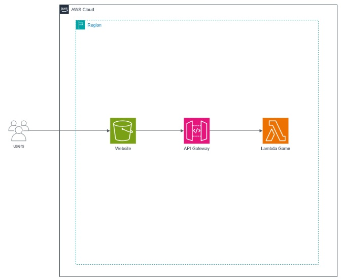
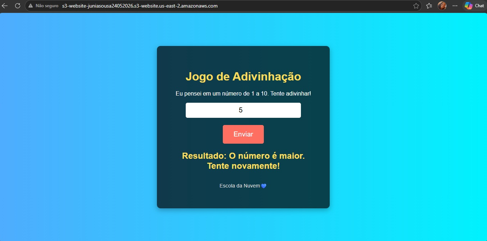
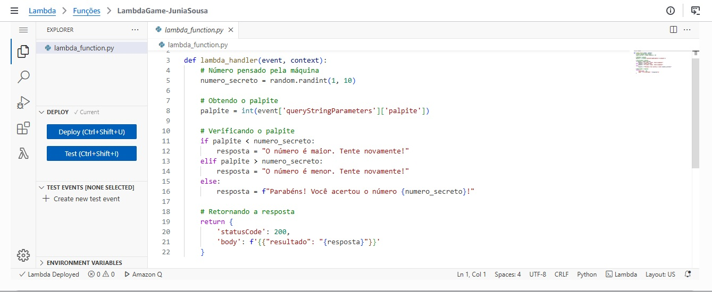
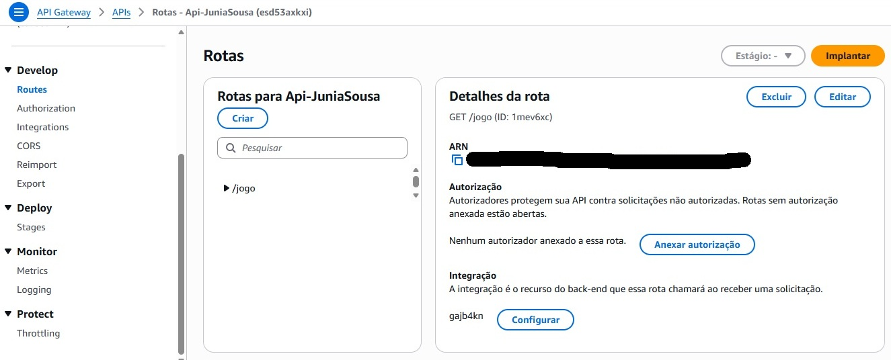
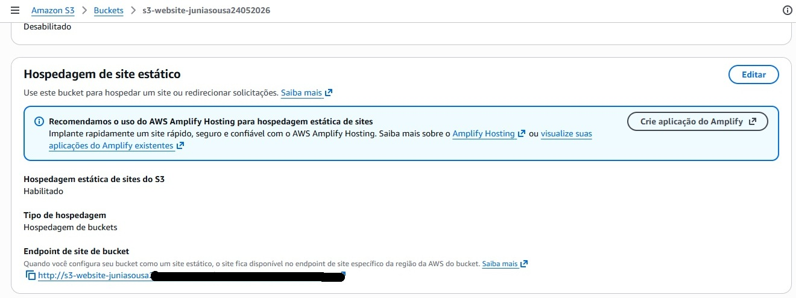

# Jogo de Adivinhação Serverless

## Objetivo

Desenvolver uma aplicação serverless utilizando AWS Lambda, Amazon API Gateway e Amazon S3.

## Serviços Utilizados

- AWS Lambda
- Amazon API Gateway
- Amazon S3
- Python

## Arquitetura

Frontend (S3)
↓
API Gateway
↓
Lambda
↓
Resposta ao usuário

## Funcionalidades

- Recebimento de número informado pelo usuário
- Processamento da lógica na função Lambda
- Retorno da resposta através da API

## Aprendizados

- Arquitetura Serverless
- Integração entre serviços AWS
- Desenvolvimento de APIs
- Hospedagem de sites estáticos

## Evidências

### Arquitetura da Solução

### Aplicação em Execução

### Implementação da Função Lambda

### Configuração da API Gateway

### Hospedagem no Amazon S3

