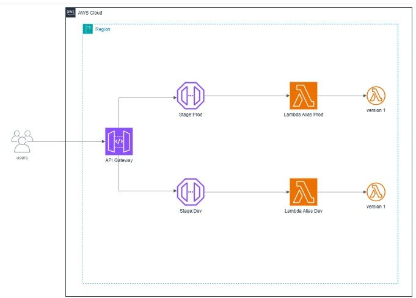
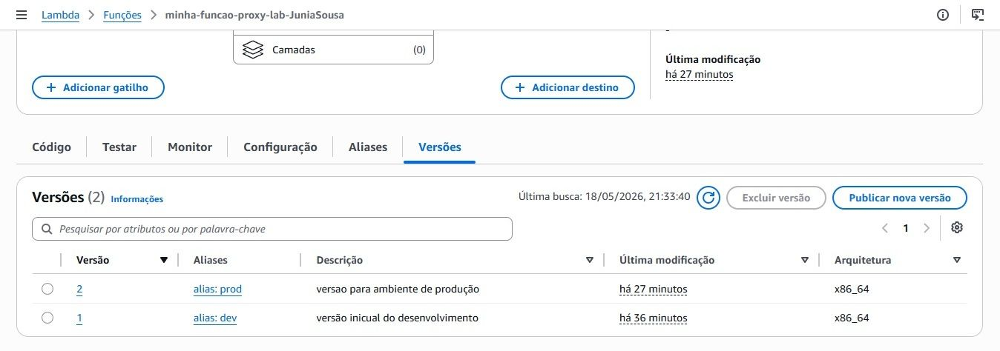
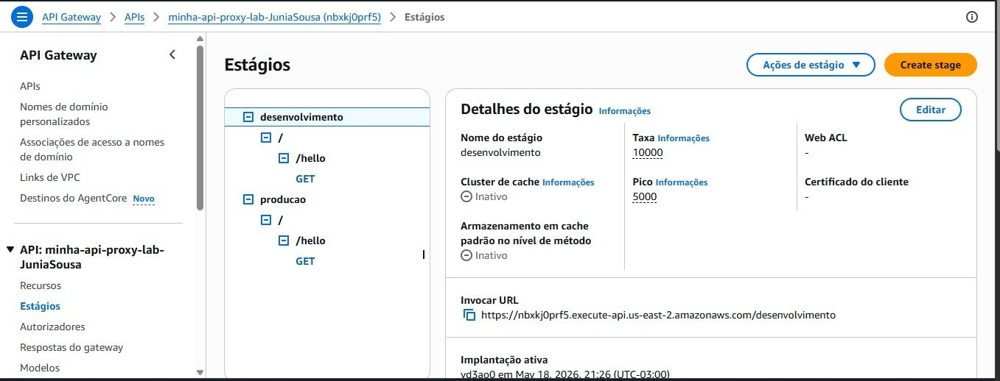
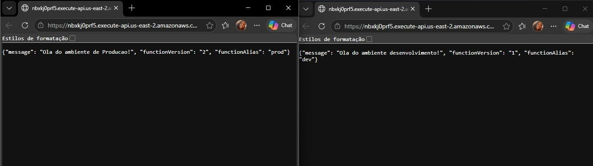

# Versionamento de Funções Lambda

## Objetivo

Implementar uma arquitetura serverless utilizando AWS Lambda e Amazon API Gateway, aplicando conceitos de versionamento, aliases e separação de ambientes de desenvolvimento e produção.

## Serviços Utilizados

- AWS Lambda
- Amazon API Gateway
- Python

## Arquitetura

AWS Lambda

↓

Versões Publicadas

↓

Aliases (Dev / Prod)

↓

Amazon API Gateway

↓

Ambientes Separados

## Funcionalidades

- Publicação de versões da função Lambda
- Criação de aliases para ambientes distintos
- Integração Proxy com Amazon API Gateway
- Configuração de stages para desenvolvimento e produção
- Deploy controlado de APIs serverless
- Testes independentes para cada ambiente

## Aprendizados

- Versionamento de funções Lambda
- Utilização de aliases para gerenciamento de versões
- Separação de ambientes Dev e Prod
- Gerenciamento do ciclo de vida de aplicações serverless
- Boas práticas de deploy em nuvem

## Evidências

### Arquitetura da Solução

### Versionamento e Aliases da Função Lambda

### Configuração dos Stages no API Gateway

### Validação dos Ambientes Dev e Prod

