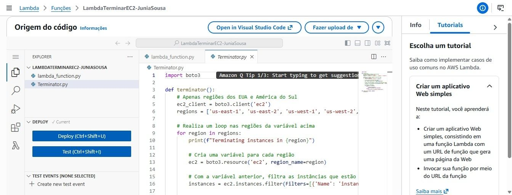

# Automação de EC2 com AWS Lambda e EventBridge

## Objetivo

Desenvolver uma solução de automação na AWS para encerramento automático de instâncias Amazon EC2 utilizando AWS Lambda, Amazon EventBridge e Python.

## Serviços Utilizados

- AWS Lambda
- Amazon EC2
- Amazon EventBridge
- AWS IAM
- Python (boto3)

## Arquitetura

Amazon EventBridge

↓

AWS Lambda

↓

Amazon EC2

↓

Encerramento Automático da Instância

## Funcionalidades

- Criação de políticas IAM e permissões de execução
- Configuração de Roles para AWS Lambda
- Desenvolvimento da função Lambda em Python
- Encerramento automatizado de instâncias EC2
- Configuração de gatilho com Amazon EventBridge
- Agendamento automático da execução

## Aprendizados

- Automação de tarefas na AWS
- Integração entre serviços cloud
- Segurança e permissões com IAM
- Arquitetura Serverless
- Automação utilizando Python e boto3

## Evidências

### Arquitetura da Solução

### Configuração do Gatilho no EventBridge

### Implementação da Função Lambda

