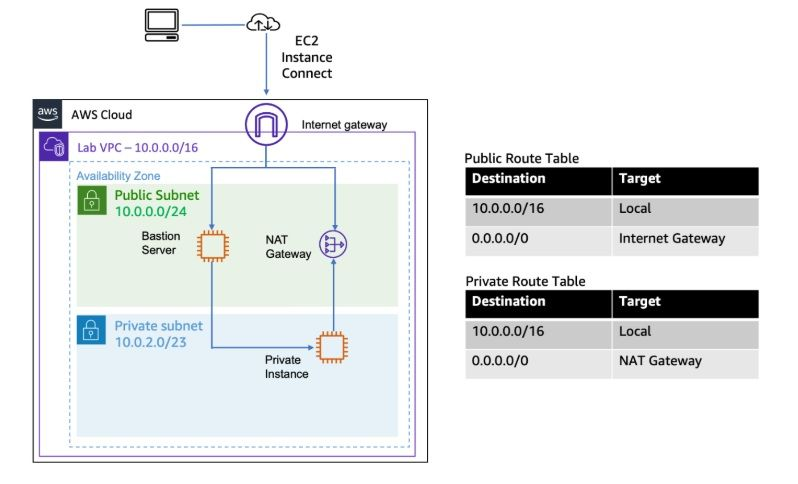
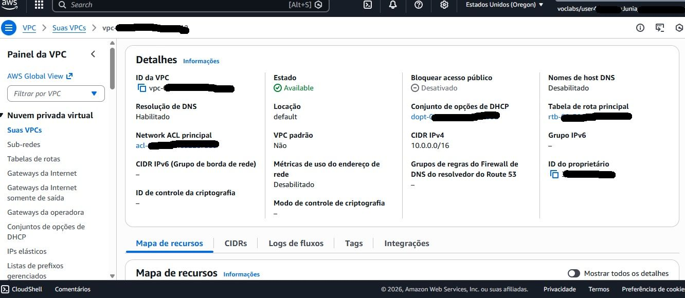
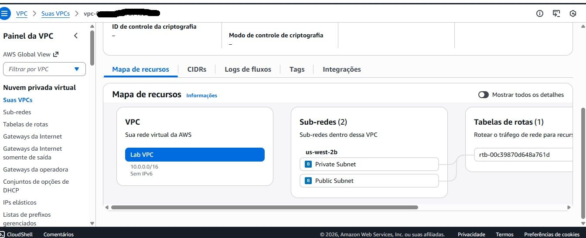
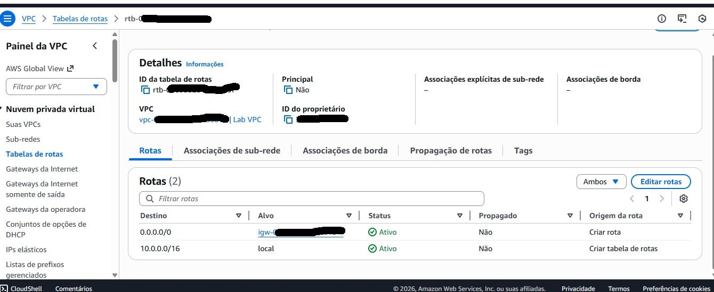

# VPC com Sub-redes Públicas e Privadas

## Objetivo

Implementar uma arquitetura de rede na AWS utilizando uma VPC personalizada com sub-redes públicas e privadas, aplicando conceitos de isolamento, segurança e conectividade.

## Serviços Utilizados

- Amazon VPC
- Amazon EC2
- Internet Gateway
- NAT Gateway

## Arquitetura

Internet

↓

Internet Gateway

↓

Sub-rede Pública

↓

Bastion Host

↓

Sub-rede Privada

↓

Instância EC2 Privada

↓

NAT Gateway

↓

Internet

## Funcionalidades

- Criação de uma VPC personalizada com CIDR definido
- Habilitação de resolução DNS
- Configuração de sub-redes públicas e privadas
- Implementação de Internet Gateway
- Implementação de NAT Gateway
- Configuração de tabelas de roteamento independentes
- Provisionamento de Bastion Host
- Acesso seguro à instância privada
- Validação da conectividade da instância privada via NAT Gateway

## Aprendizados

- Arquitetura de redes na AWS
- Segmentação de ambientes
- Isolamento de recursos
- Segurança em camadas
- Configuração de rotas e gateways
- Boas práticas para ambientes de produção

## Evidências

### Arquitetura da Solução

### Configuração da VPC

### Configuração das Sub-redes

### Configuração das Tabelas de Rotas

