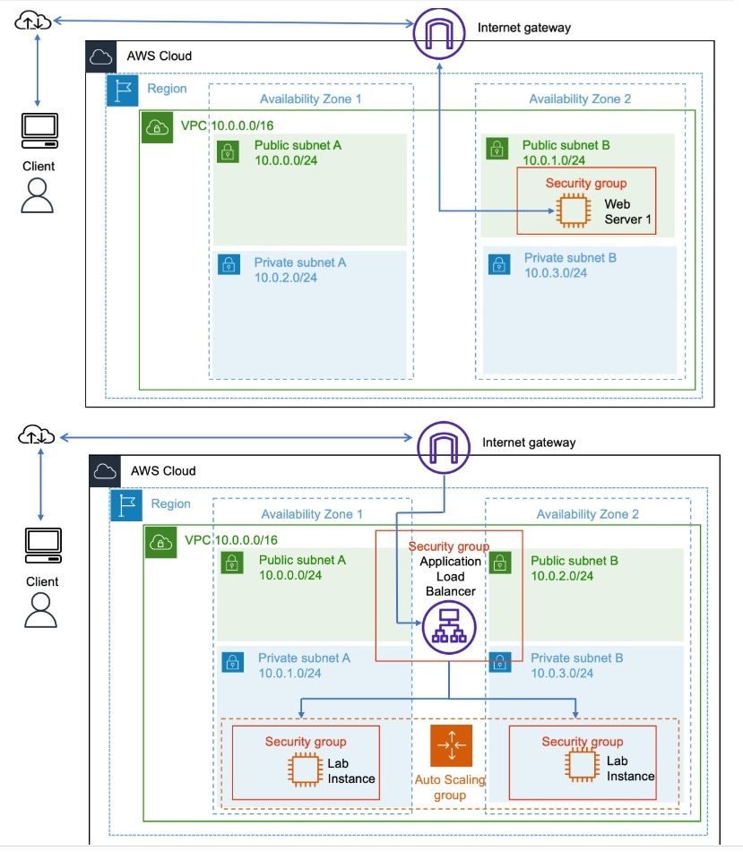
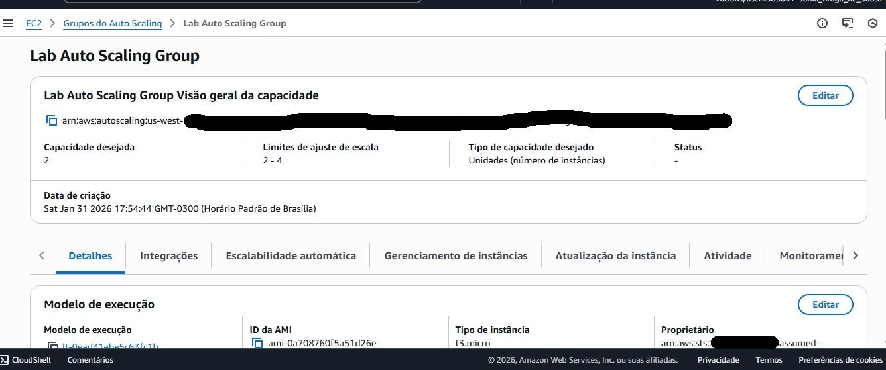
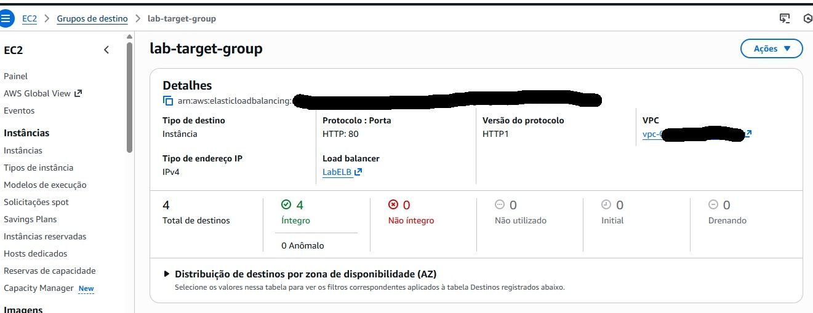
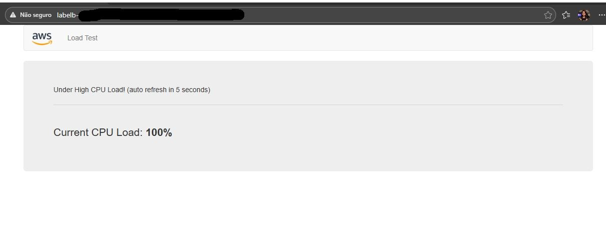

# Arquitetura Escalável e Alta Disponibilidade

## Objetivo

Implementar uma arquitetura escalável e altamente disponível na AWS utilizando Auto Scaling, Application Load Balancer e monitoramento com CloudWatch.

## Serviços Utilizados

- Amazon EC2
- Application Load Balancer (ALB)
- Auto Scaling Group
- Amazon CloudWatch
- Amazon Machine Image (AMI)

## Arquitetura

Cliente

↓

Application Load Balancer (ALB)

↓

Auto Scaling Group

↓

Instâncias EC2 em múltiplas Zonas de Disponibilidade

↓

Monitoramento com CloudWatch

↓

Escalabilidade Automática

## Funcionalidades

- Criação de uma AMI personalizada a partir de uma instância EC2
- Configuração de Launch Template
- Criação de Auto Scaling Group
- Distribuição de tráfego utilizando Application Load Balancer
- Implementação de escalabilidade automática baseada em CPU
- Monitoramento através do Amazon CloudWatch
- Implantação em múltiplas Zonas de Disponibilidade

## Aprendizados

- Alta disponibilidade na AWS
- Escalabilidade horizontal
- Balanceamento de carga
- Automação de infraestrutura
- Observabilidade com CloudWatch
- Arquiteturas resilientes para produção

## Evidências

### Arquitetura da Solução

### Configuração do Auto Scaling Group

### Configuração do Application Load Balancer

### Target Group com Instâncias Saudáveis

### Teste de Carga para Escalabilidade

