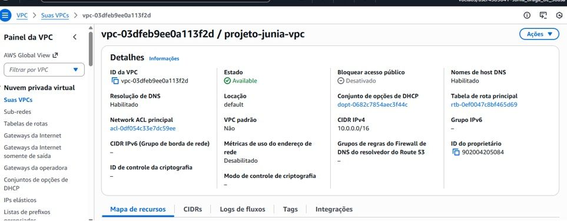
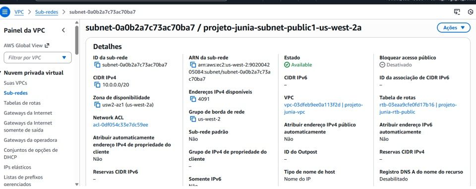
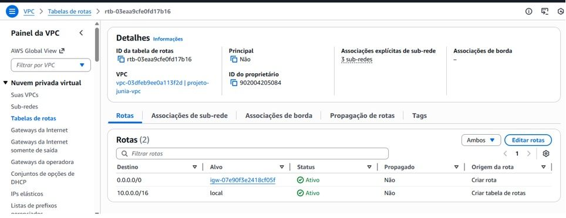
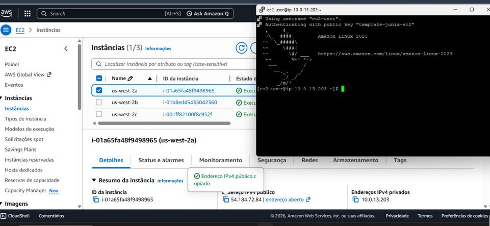
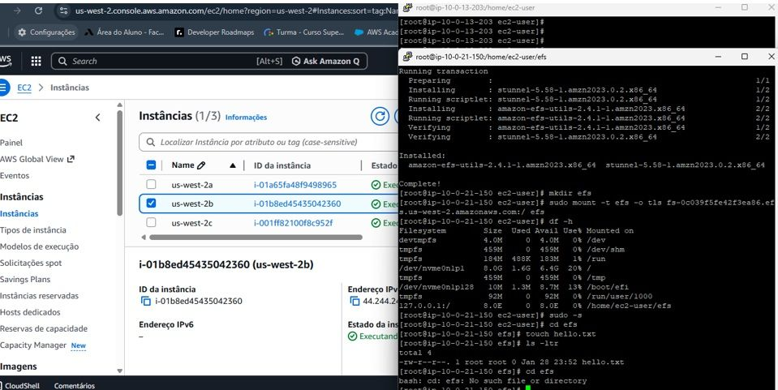

# Armazenamento Compartilhado com Amazon EFS

## Objetivo

Implementar uma arquitetura de armazenamento compartilhado utilizando Amazon EFS, permitindo que múltiplas instâncias Amazon EC2 acessem os mesmos arquivos simultaneamente.

## Serviços Utilizados

- Amazon EC2
- Amazon EFS
- Amazon VPC
- Internet Gateway
- Amazon Linux

## Arquitetura

Amazon EFS

↓

Instância EC2 (AZ 1)

↓

Armazenamento Compartilhado

↓

Instância EC2 (AZ 2)

## Funcionalidades

- Criação de uma VPC personalizada
- Configuração de sub-redes em múltiplas Zonas de Disponibilidade
- Configuração de Internet Gateway e rotas
- Provisionamento de instâncias EC2
- Acesso remoto via SSH
- Criação e montagem de um sistema de arquivos Amazon EFS
- Compartilhamento de dados entre múltiplas instâncias
- Validação da persistência dos dados

## Aprendizados

- Armazenamento distribuído na AWS
- Compartilhamento de arquivos entre servidores
- Arquiteturas altamente disponíveis
- Configuração de redes e conectividade
- Administração de ambientes Linux na AWS
- Boas práticas de infraestrutura em nuvem

## Evidências

### VPC Configurada

### Sub-rede Pública

### Tabela de Rotas

### Acesso SSH à Instância EC2

### Compartilhamento de Arquivos com Amazon EFS

