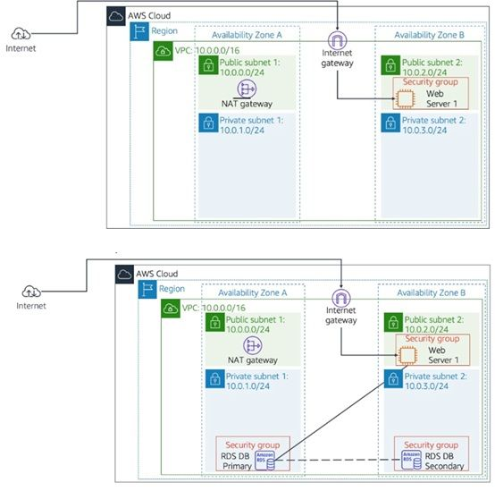
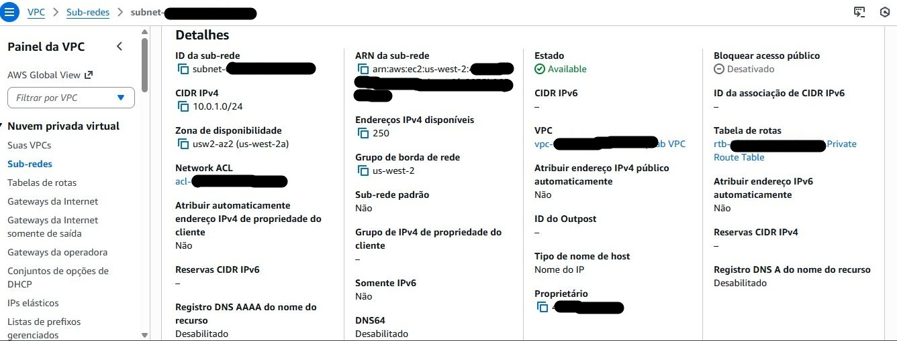
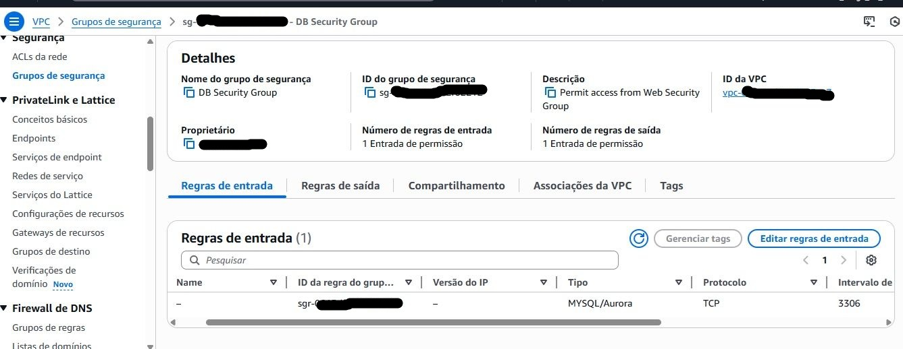
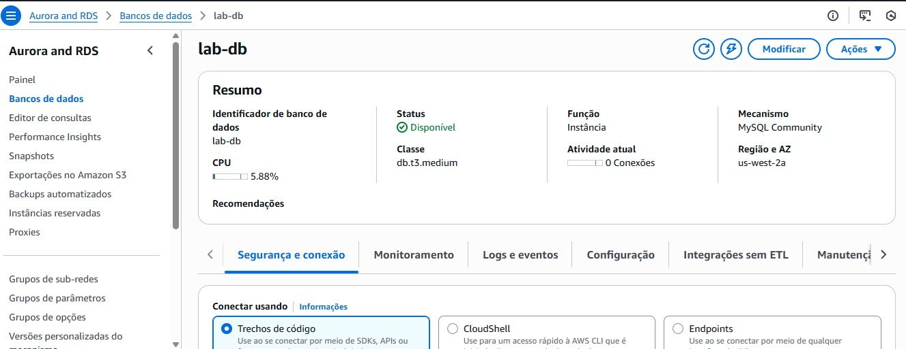
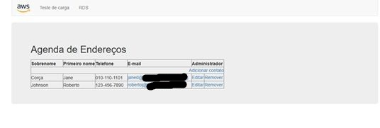

# Amazon RDS na Prática

## Objetivo

Implementar uma arquitetura de banco de dados relacional gerenciado utilizando Amazon RDS (MySQL), aplicando conceitos de segurança, alta disponibilidade e integração com aplicações web.

## Serviços Utilizados

- Amazon RDS
- Amazon EC2
- Amazon VPC
- Security Groups
- MySQL

## Arquitetura

Aplicação Web (EC2)

↓

Security Group

↓

Amazon RDS (MySQL)

↓

Armazenamento Gerenciado

## Funcionalidades

- Criação e configuração de uma instância Amazon RDS
- Configuração de DB Subnet Group
- Configuração de Security Groups
- Integração entre aplicação web e banco de dados
- Operações CRUD (inserção, edição e exclusão de dados)
- Configuração Multi-AZ para alta disponibilidade

## Aprendizados

- Administração de bancos de dados gerenciados
- Configuração de redes para bancos de dados
- Controle de acesso com Security Groups
- Integração entre aplicações e RDS
- Conceitos de alta disponibilidade
- Boas práticas de segurança em nuvem

## Evidências

### Arquitetura da Solução

### Configuração da DB Subnet

### Grupo de Segurança do Banco de Dados

### Instância Amazon RDS

### Aplicação Integrada ao Banco de Dados

