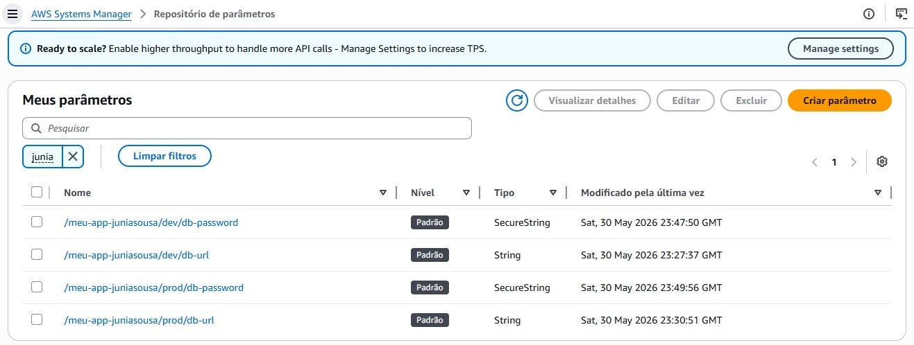
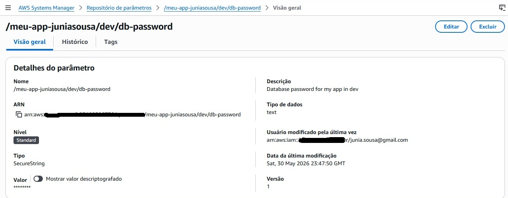
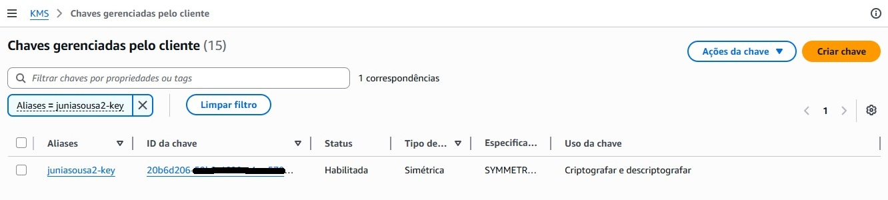
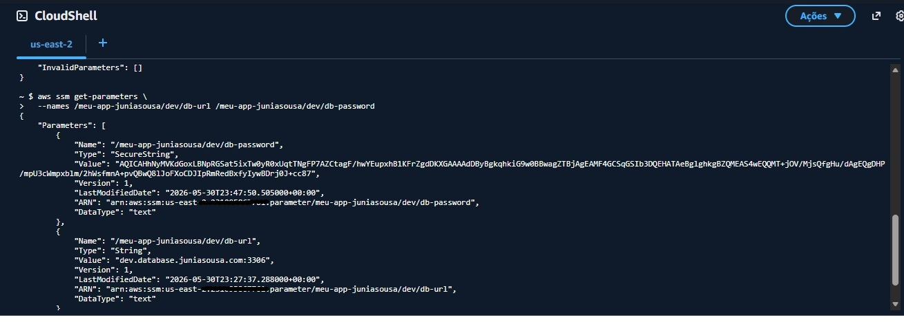
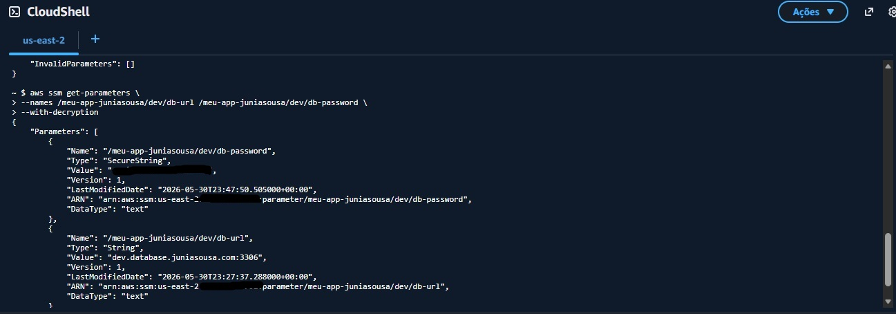

# AWS Systems Manager Parameter Store com AWS KMS

## Objetivo

Implementar o armazenamento seguro de configurações e credenciais utilizando o AWS Systems Manager Parameter Store e AWS KMS, permitindo o gerenciamento centralizado de informações sensíveis e o acesso via AWS CLI.

## Serviços Utilizados

- AWS Systems Manager (SSM)
- AWS Parameter Store
- AWS Key Management Service (KMS)
- AWS CloudShell
- AWS CLI

## Arquitetura

```text
Parameter Store
      ↓
 String e SecureString
      ↓
    AWS KMS
      ↓
 AWS CloudShell
      ↓
    AWS CLI
```

## Funcionalidades

- Criação de parâmetros String
- Criação de parâmetros SecureString
- Criptografia com AWS KMS
- Consulta de parâmetros via AWS CLI
- Descriptografia utilizando `--with-decryption`
- Gerenciamento centralizado de configurações

## Aprendizados

- Gerenciamento de configurações na AWS
- Armazenamento seguro de credenciais
- Criptografia utilizando AWS KMS
- Uso do Parameter Store
- Administração com AWS CLI
- Boas práticas de segurança em nuvem

## Evidências

### Lista de Parâmetros Criados



### Detalhes do Parâmetro SecureString



### Chave KMS Criada



### Consulta sem Descriptografia



### Consulta com Descriptografia



## Resultado

Neste laboratório foi possível criar parâmetros seguros utilizando o AWS Systems Manager Parameter Store, protegendo informações sensíveis com AWS KMS e acessando os dados através da AWS CLI no CloudShell.
