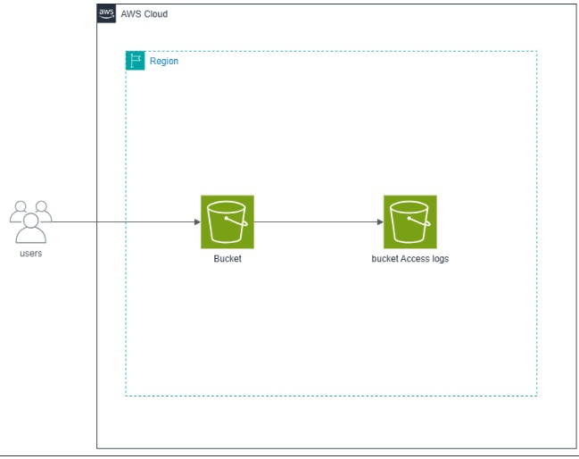
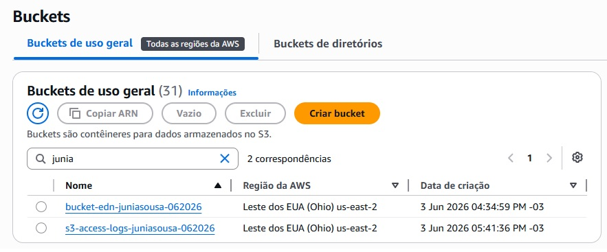
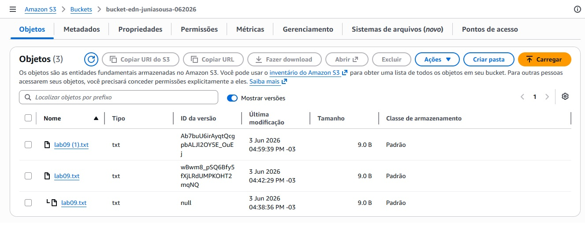
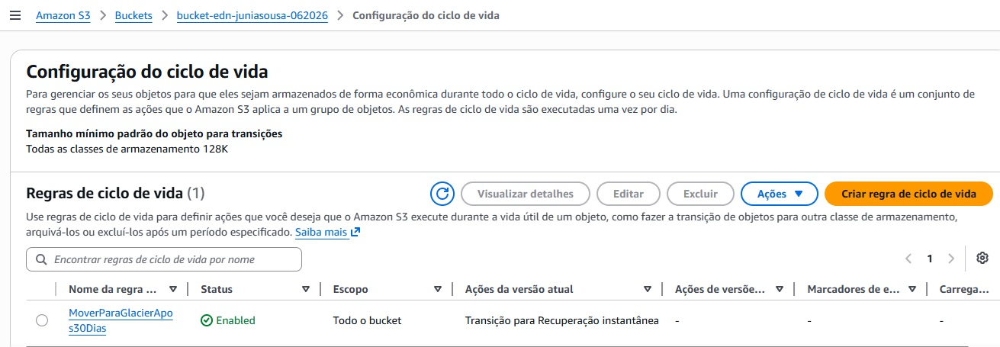
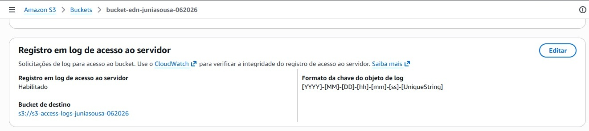

# Amazon S3 – Gerenciamento, Versionamento e Access Logs

## Objetivo

Implementar práticas de armazenamento seguro e gerenciamento de dados utilizando o Amazon S3, incluindo versionamento de objetos, regras de ciclo de vida, compartilhamento seguro através de URLs pré-assinadas e monitoramento de acessos com Access Logs.

## Serviços Utilizados

- Amazon S3

## Arquitetura

```text
Usuários
    ↓
Bucket S3
    ↓
Versionamento
    ↓
Lifecycle Rules
    ↓
URLs Pré-assinadas
    ↓
Bucket de Access Logs
```

## Funcionalidades

- Criação de buckets com configurações seguras
- Upload e gerenciamento de objetos
- Habilitação de versionamento
- Recuperação de versões anteriores de arquivos
- Configuração de regras de ciclo de vida
- Transição automática para Glacier Instant Retrieval
- Geração de URLs pré-assinadas
- Configuração de Access Logs
- Monitoramento de acessos aos objetos

## Aprendizados

- Armazenamento de objetos na AWS
- Versionamento de arquivos no Amazon S3
- Otimização de custos com Lifecycle Policies
- Compartilhamento seguro utilizando URLs pré-assinadas
- Auditoria e rastreamento de acessos
- Configuração de buckets com boas práticas de segurança
- Gerenciamento do ciclo de vida dos dados
- Monitoramento de operações em ambientes Cloud

## Evidências

### Arquitetura



### Buckets Criados



### Histórico de Versões



### Regra de Ciclo de Vida



### Access Logs



## Resultado

Neste laboratório foi possível explorar recursos fundamentais do Amazon S3, incluindo versionamento de objetos, automação do ciclo de vida dos dados, compartilhamento seguro por meio de URLs pré-assinadas e monitoramento de acessos através de Access Logs. A prática demonstrou como aplicar boas práticas de armazenamento, segurança, auditoria e otimização de custos em ambientes de nuvem.
