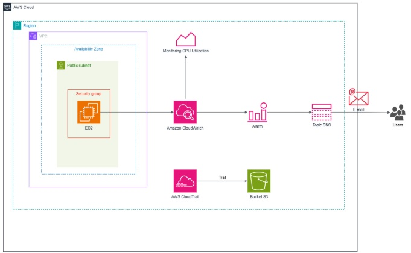
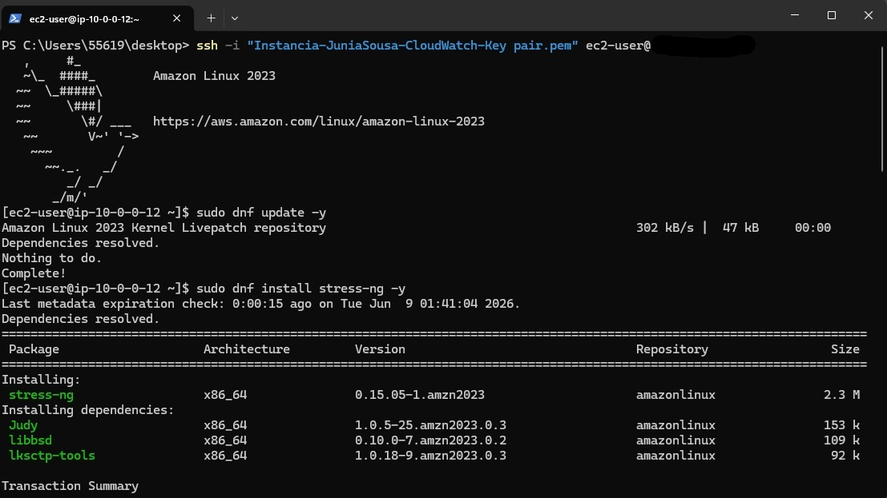
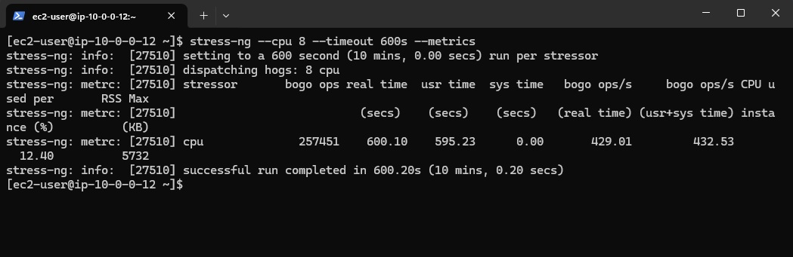
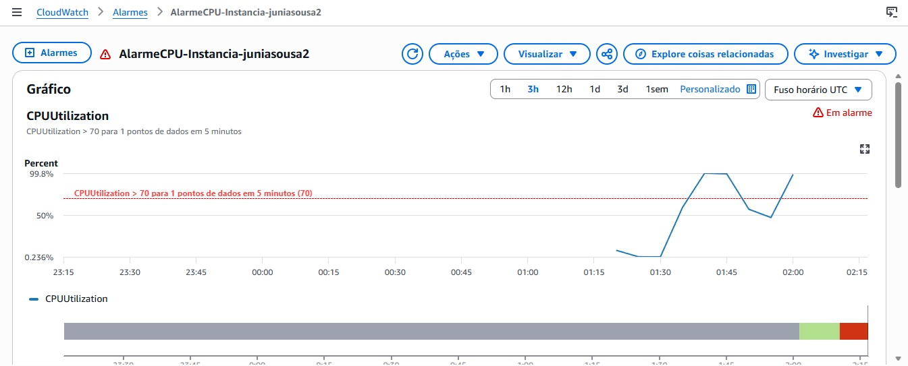
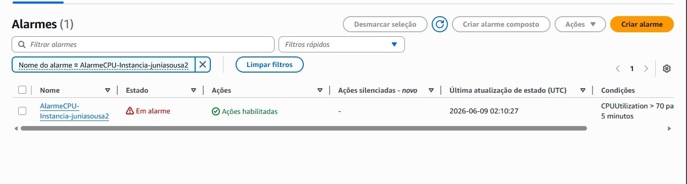
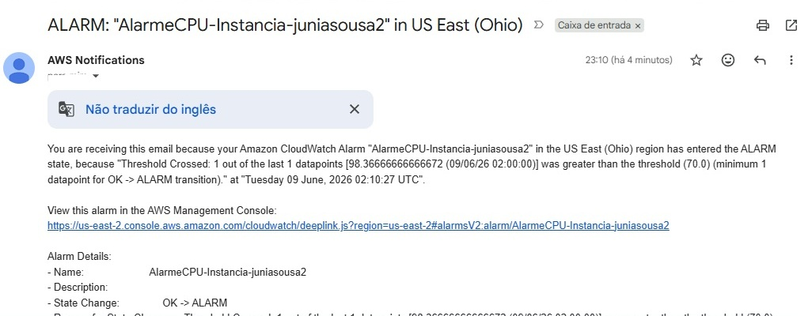
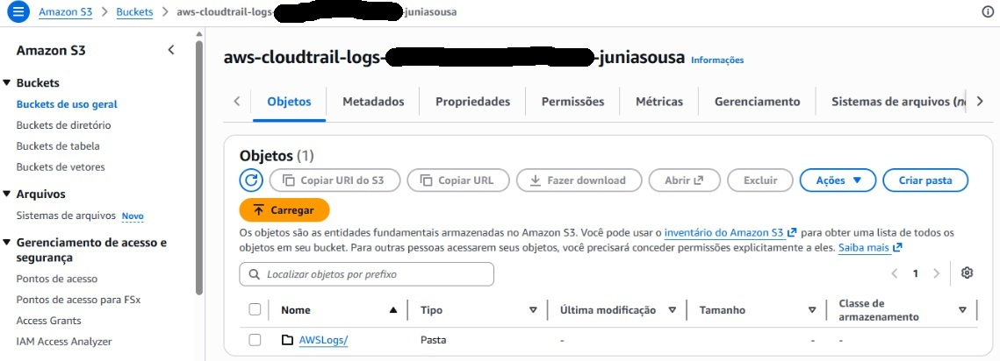

# Monitoramento e Auditoria com CloudWatch e CloudTrail na AWS

## Objetivo

Implementar uma solução de monitoramento e auditoria na AWS utilizando Amazon CloudWatch, Amazon SNS, AWS CloudTrail e Amazon S3. O laboratório demonstra como monitorar métricas de uma instância EC2, disparar alarmes automáticos, receber notificações por e-mail e armazenar logs de auditoria para fins de segurança e conformidade.

## Serviços Utilizados

* Amazon EC2
* Amazon CloudWatch
* Amazon SNS
* AWS CloudTrail
* Amazon S3

## Arquitetura

EC2

↓

Amazon CloudWatch

↓

Alarme de CPU

↓

Amazon SNS

↓

E-mail de Notificação

AWS CloudTrail

↓

Amazon S3 (Logs de Auditoria)

## Funcionalidades

* Criação de instância EC2 para testes
* Monitoramento da métrica CPUUtilization
* Configuração de alarmes no Amazon CloudWatch
* Envio de notificações por e-mail utilizando Amazon SNS
* Simulação de carga de CPU com stress-ng
* Criação de trilha de auditoria com AWS CloudTrail
* Armazenamento de logs em bucket Amazon S3
* Monitoramento de eventos e atividades da conta AWS
* Validação do disparo automático de alarmes

## Aprendizados

* Monitoramento de recursos utilizando Amazon CloudWatch
* Configuração de alarmes baseados em métricas
* Integração entre CloudWatch e Amazon SNS
* Simulação de carga em instâncias EC2 utilizando stress-ng
* Auditoria de atividades da conta com AWS CloudTrail
* Armazenamento de logs em buckets Amazon S3
* Implementação de práticas de observabilidade em ambientes Cloud
* Observabilidade e monitoramento de ambientes Cloud
* Aplicação de conceitos de segurança e governança na AWS
* Monitoramento proativo de infraestrutura

## Evidências

### Arquitetura

### Instalação do Stress-ng

### Simulação de Carga na CPU

### Monitoramento da CPU

### Alarme Disparado

### Notificação por E-mail

### Logs de Auditoria

## Resultado

Neste laboratório foi possível implementar uma solução completa de monitoramento e auditoria na AWS. A prática envolveu a criação de uma instância EC2, a configuração de alarmes no Amazon CloudWatch, o envio de notificações automáticas por e-mail através do Amazon SNS e a auditoria das atividades da conta utilizando AWS CloudTrail com armazenamento dos logs em um bucket Amazon S3.

A atividade permitiu aplicar conceitos fundamentais de observabilidade, monitoramento, auditoria, segurança e governança em ambientes de nuvem, simulando um cenário próximo ao encontrado em ambientes corporativos.
