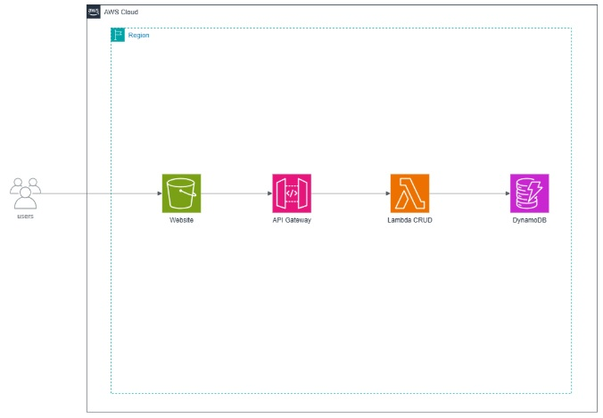
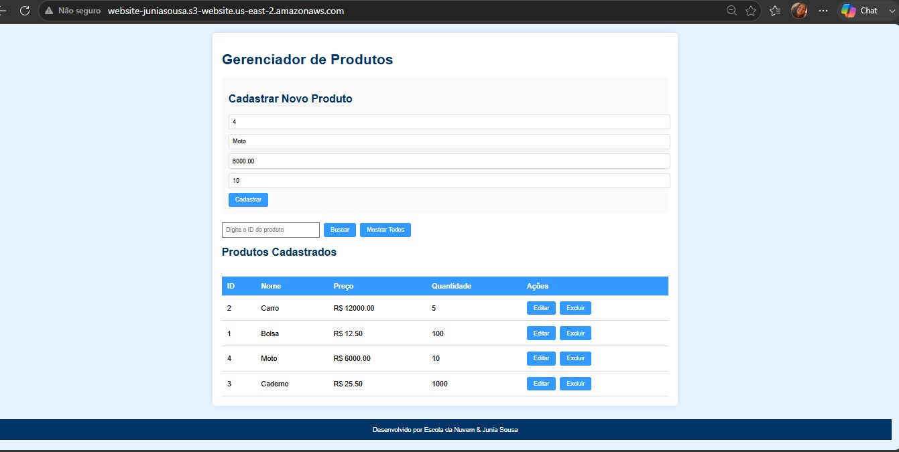
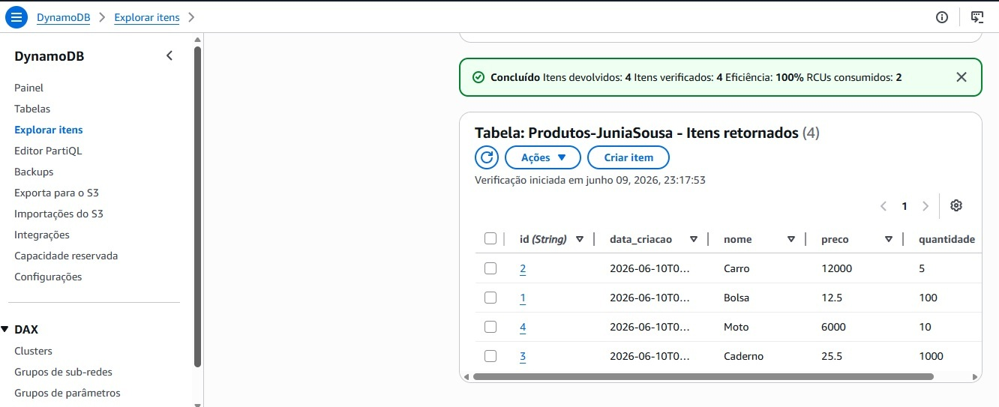
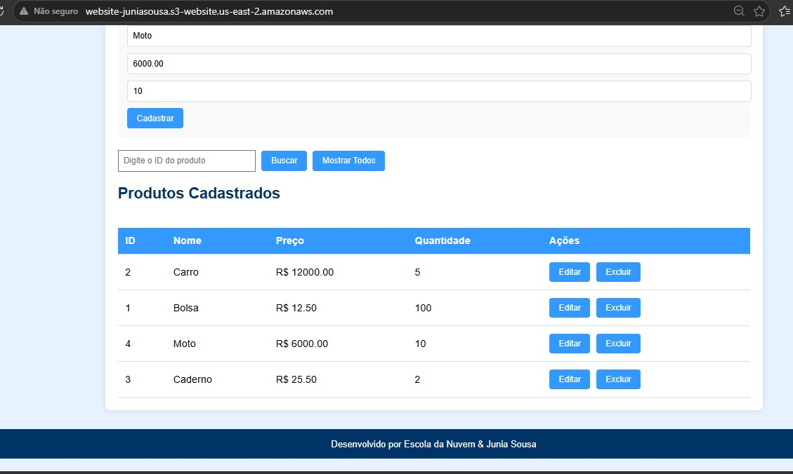
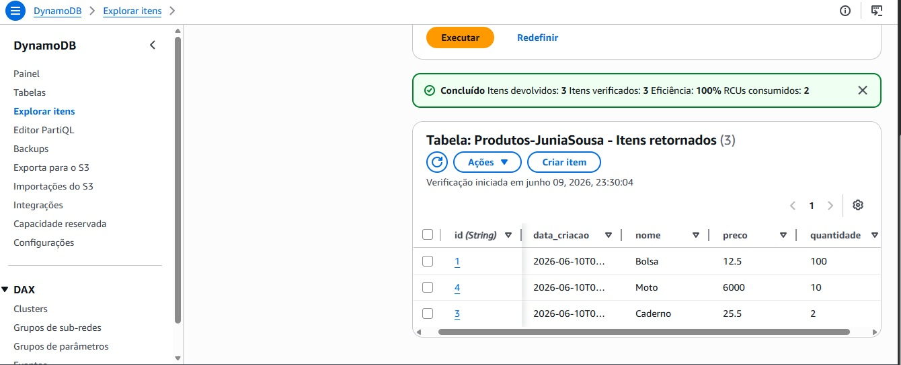
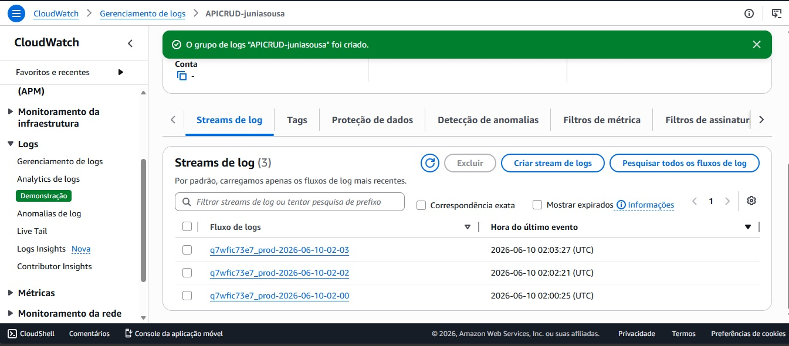

# Criação de Tabela DynamoDB e Operação CRUD com Python

## Objetivo

Implementar uma aplicação serverless na AWS utilizando Amazon DynamoDB, AWS Lambda, API Gateway e Amazon S3. O laboratório demonstra a criação de uma API para operações CRUD (*Create, Read, Update e Delete*), integração entre serviços AWS e monitoramento através do Amazon CloudWatch.

---

## Serviços Utilizados

* Amazon DynamoDB
* AWS Lambda
* Amazon API Gateway
* Amazon S3
* Amazon CloudWatch
* AWS IAM

---

## Arquitetura

```text
Usuário
    ↓
Website Estático (Amazon S3)
    ↓
Amazon API Gateway
    ↓
AWS Lambda
    ↓
Amazon DynamoDB
```

---

## Funcionalidades

* Criação de tabela no Amazon DynamoDB
* Desenvolvimento de função Lambda em Python
* Implementação das operações CRUD
* Integração entre API Gateway e Lambda
* Hospedagem de interface web estática no Amazon S3
* Configuração de permissões utilizando IAM Roles
* Configuração de CORS para integração entre front-end e API
* Armazenamento de dados no DynamoDB
* Monitoramento de chamadas da API com CloudWatch Logs
* Atualização e exclusão de registros através da interface web

---

## Aprendizados

* Criação de aplicações Serverless na AWS
* Integração entre API Gateway, Lambda e DynamoDB
* Desenvolvimento de funções Lambda em Python
* Implementação de operações CRUD em banco de dados NoSQL
* Hospedagem de aplicações estáticas no Amazon S3
* Configuração de permissões utilizando IAM
* Monitoramento e troubleshooting com CloudWatch Logs
* Configuração de CORS para aplicações web
* Manipulação de dados utilizando Amazon DynamoDB
* Arquitetura moderna baseada em serviços gerenciados

---

## Evidências

### Arquitetura



### Aplicação Web Funcionando



### Produtos Armazenados no DynamoDB



### Atualização de Produto



### Exclusão de Produto



### Logs da API no CloudWatch



---

## Resultado

Neste laboratório foi possível desenvolver uma aplicação serverless completa utilizando serviços da AWS. A solução integrou uma interface web hospedada no Amazon S3 com uma API construída através do Amazon API Gateway e AWS Lambda, utilizando o Amazon DynamoDB para persistência dos dados.

Durante a atividade foram implementadas operações CRUD para gerenciamento de produtos, além da configuração de permissões com IAM e monitoramento das requisições por meio do Amazon CloudWatch Logs.

A prática permitiu aplicar conceitos fundamentais de arquitetura serverless, integração de serviços AWS, bancos de dados NoSQL, monitoramento de aplicações e desenvolvimento de APIs escaláveis, simulando um cenário próximo ao encontrado em ambientes corporativos.

